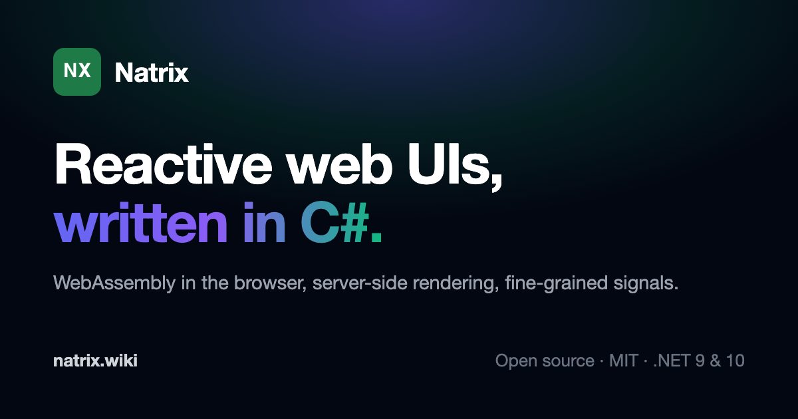

<a href="https://natrix.wiki"></a>

**Website and docs: [natrix.wiki](https://natrix.wiki)**

Natrix is a .NET framework for building web UIs in C# that run in the browser on WebAssembly. Pages render on the server first, then fine-grained signals update exactly the DOM nodes that changed. There's no virtual DOM, no Razor and no JavaScript to write, and Tailwind CSS is compiled at build time.

## Getting started

Install the template and create an app. It writes a server project and a WebAssembly client project into the current directory:

```bash
dotnet new install Natrix.Templates
mkdir MyNatrixApp && cd MyNatrixApp
dotnet new natrix -n MyNatrixApp
dotnet run --project MyNatrixApp/MyNatrixApp.csproj
```

The app comes with server-side rendering, client-side routing and Tailwind CSS already wired up. The [Quick Start](https://natrix.wiki/docs/quick-start) walks through it.

A component is a C# class. `Setup` runs once, and from then on only the parts that read a signal update:

```csharp
public class Counter : BaseComponent<NoProps, NoEvents, NoSlots, NoExpose>
{
    protected override IComponent[] Setup(out NoExpose exposed)
    {
        exposed = default;

        var count = new Signal<int>(0);
        var doubled = new Computed<int>(() => count.Value * 2);

        return
        [
            new Button
            {
                Props = new ButtonProps(),
                Events = new ButtonEvents { OnClick = _ => count.Value++ },
                Children = [new DomText { Text = "Click me".ToConstSignal() }],
            },
            new P
            {
                Props = new PProps(),
                Children = [new DomText { Text = new Computed<string>(
                    () => $"{count.Value} × 2 = {doubled.Value}") }],
            },
        ];
    }
}
```

## Packages

**Building apps**

- [Natrix.Core](src/Natrix.Core/): the component model, rendering, routing and source generators.
- [Natrix.Signals](src/Natrix.Signals/): the reactive primitives (`Signal`, `Computed`, `Effect`) that drive updates.
- [Natrix.Dom](src/Natrix.Dom/): typed components for HTML elements (`Div`, `A`, `Input`, `Select` and the rest), rendering both in the browser and on the server.
- [Natrix.Browser](src/Natrix.Browser/): the browser render root and host integration for the WebAssembly client.
- [Natrix.Ssr](src/Natrix.Ssr/): server-side rendering for ASP.NET Core hosts, including hydration state and server prefetching.
- [Natrix.TailwindCss](src/Natrix.TailwindCss/): Tailwind CSS compiled by a source generator at build time, with no Node, npm or CLI needed.
- [Natrix.Swr](src/Natrix.Swr/): stale-while-revalidate data fetching, ported from React SWR.
- [Natrix.Composables.Dom](src/Natrix.Composables.Dom/): VueUse-style composables, such as `UseHead` for the document title and meta tags.
- [Natrix.Templates](src/Natrix.Templates/): the `dotnet new natrix` template.

**Browser APIs and interop**

- [Natrix.StdWeb](src/Natrix.StdWeb/): strongly typed C# bindings for standard Web APIs such as the DOM, Fetch, Canvas and WebGL, generated from the W3C WebIDL specifications by [Natrix.WebIDLGenerator](src/Natrix.WebIDLGenerator/).
- [Natrix.JSCore](src/Natrix.JSCore/): the JavaScript proxy system, type marshalling and low-level interop that StdWeb is built on.

## Documentation

- [natrix.wiki](https://natrix.wiki) is the documentation site, with runnable examples. Its source is in [docs/](docs/).
- [Natrix.Core](src/Natrix.Core/README.md) explains the component framework and rendering model.
- [Natrix.TailwindCss](src/Natrix.TailwindCss/README.md) explains the build-time Tailwind integration.
- [Natrix.StdWeb](src/Natrix.StdWeb/README.md) explains the generated browser API bindings.
- [Natrix.Swr](src/Natrix.Swr/README.md) explains stale-while-revalidate data fetching.
- [Natrix.Composables.Dom](src/Natrix.Composables.Dom/README.md) explains the composables and `UseHead`.

## Requirements

- .NET 9.0 or later
- A browser with WebAssembly support

Building this repository also needs Node.js and npm on `PATH`: the Tailwind generator bundles its JavaScript from source during the build. Apps that use the packages don't need either.

## Status

Natrix is under active development and APIs may still change between releases.

## License

This project is licensed under the MIT License. See [LICENSE](LICENSE) for details.
