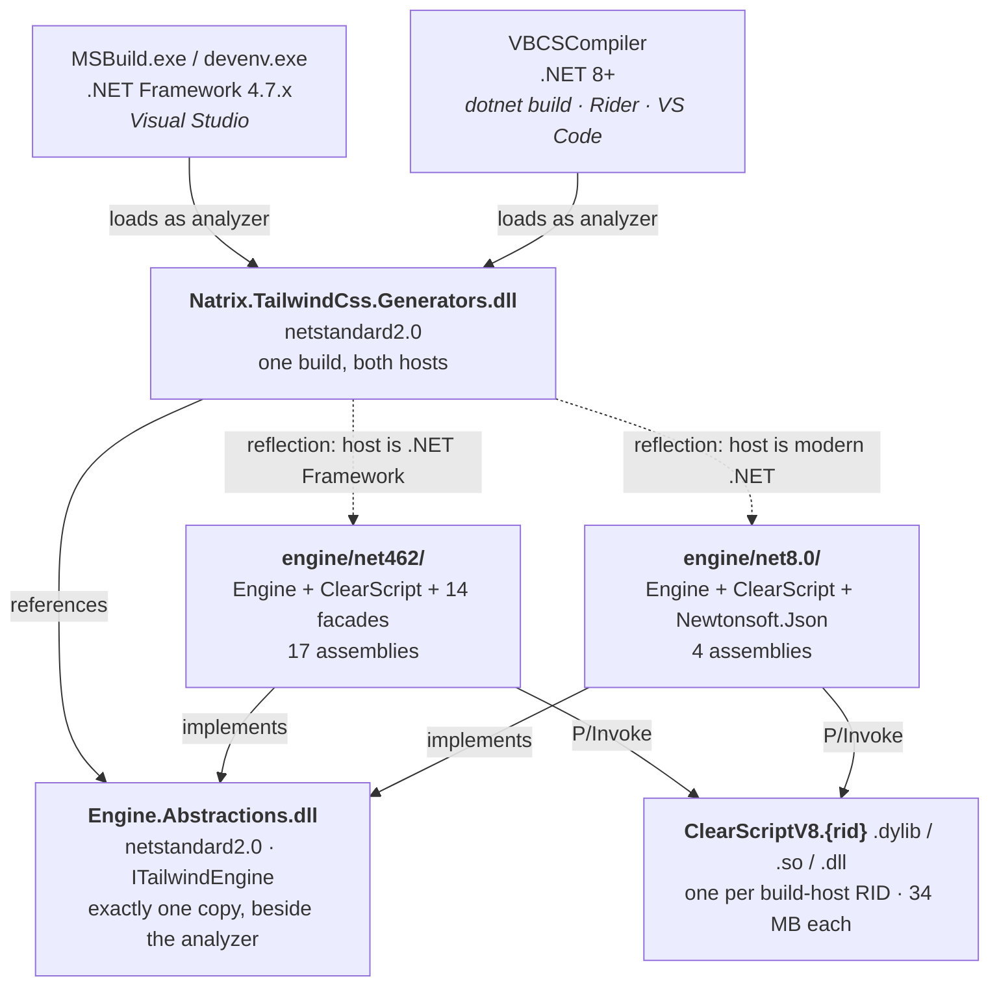
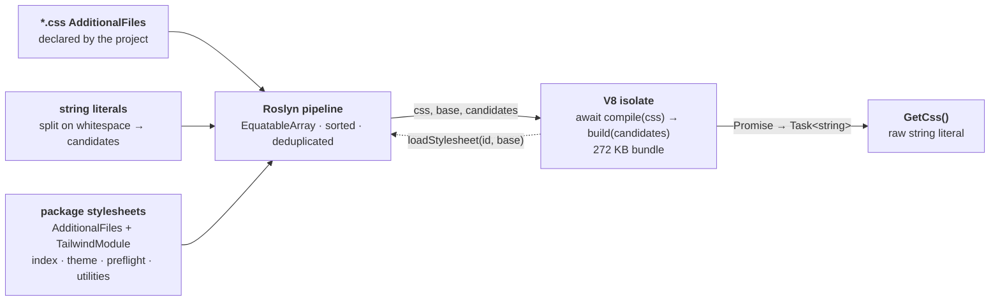

# Tailwind CSS generator — architecture

Visual companion to [`CLAUDE.md`](CLAUDE.md), which holds the rules and the
reasoning. This file is just the two pictures worth drawing.

`[GeneratedTailwindCss("Styles/app.css")]` turns a partial method into the
compiled Tailwind stylesheet for that entry file. The generator runs the real
Tailwind compiler — the actual JavaScript, bundled by esbuild and executed in a
V8 isolate via ClearScript — during the build.

## Runtime layering

A source generator runs inside the compiler host, and that host is not always
the same runtime. The whole project split falls out of that one fact:
Roslyn requires the analyzer to be `netstandard2.0` (RS1041), ClearScript ships
no `netstandard2.0` asset, and .NET Framework cannot load its `netstandard2.1`
one. So the analyzer cannot reference ClearScript in either direction.



The dotted arrows are the reflection boundary: the analyzer holds no
compile-time reference to ClearScript, and `ClearScriptLoader` picks a flavor at
load time from `RuntimeInformation.FrameworkDescription`. Nothing managed from
ClearScript is ever resolved by the compiler host itself.

Reflection is used exactly once — `Activator.CreateInstance` on the engine type,
cast to `ITailwindEngine` — and every later call is a plain interface call. That
only works because the contract assembly is loaded once: it ships beside the
analyzer and is excluded from both flavor directories, or the interface would have
two identities and the cast would fail.

`net462` carries 17 assemblies to `net8.0`'s 4 because ClearScript's .NET
Framework asset depends on `Microsoft.Bcl.AsyncInterfaces`, `System.Memory`,
`System.ValueTuple` and friends. They are shipped by globbing the engine
project's real build output — hand-listing them is how one goes missing and
Visual Studio fails at runtime.

## How a stylesheet becomes a string



The dotted arrow is the load-bearing one. Tailwind calls back into C# for every
`@import`, and resolution never touches the filesystem — each one is answered
from the `AdditionalFiles` snapshot Roslyn supplied. That is precisely what makes
editing a `.css` file re-run the compilation.

Note the asymmetry it creates: the pipeline reads *every* stylesheet the project
listed, while the resolver serves only the ones actually imported. A file nothing
imports never reaches the output, but editing it still invalidates the step and
re-runs the compile.

### How an import is resolved

The package globs nothing on the project's behalf — a project lists its own
stylesheets as `AdditionalFiles`. An `@import` is then answered in this order:

1. **Relative to the importing file** — `./x`, `../x`, or a bare `x`. The
   directory it is relative to is the `base` Tailwind passes to `loadStylesheet`,
   which is the importing stylesheet's own directory. An already-absolute
   specifier is taken as it stands.
2. **Module ids.** Files carrying `TailwindModule` metadata register the ids they
   answer to. Matching is exact, like a `package.json` `"exports"` map: a file a
   package did not declare cannot be imported by id.

For 1 the resolver also tries `x.css` and `x/index.css`.

Relative wins over a module of the same name, matching `@tailwindcss/vite`: it
creates its CSS resolver with `preferRelative: true`, and Tailwind consults that
resolver before the `node_modules` lookup.

Every stylesheet is keyed by its absolute path, so nothing in resolution depends
on where a file sits relative to the project. The chain is anchored by the entry
stylesheet, whose path in `[GeneratedTailwindCss]` is resolved against the
**source file that declares the attribute**; its directory becomes the `base`
passed to `compile()`.

The `base` returned with each hit is the resolved file's **own directory**, which
is what lets a package reference its internal, unexported stylesheets while
callers cannot.

## What triggers a recompile

The generated CSS is produced by combining four pipeline values — the attributed
method, the stylesheet set, the candidate set, and the engine directory. Roslyn
compares each by value, so **the Tailwind compiler runs again whenever any one of
them differs**, and skips entirely when none do. In an IDE this is evaluated on
essentially every keystroke.

Every row below is pinned down by a test in `IncrementalityTests`.

### Re-runs the compiler

| Change | Why |
| --- | --- |
| Any `.css` file edited — **including one nothing imports** | The whole stylesheet set is a single pipeline value |
| A `.css` file added, removed or renamed | Same |
| A string literal that introduces a **new** whitespace-separated token | The candidate set changed |
| Editing anything **above the attribute in its own file** | The model carries the attribute's text span for diagnostics, and inserting a line shifts it |
| The attribute argument, method name, accessibility, `static`, or return type | All part of the method model |
| `NatrixTailwindEngineDir` | It is combined into the output |
| Moving the file the attribute is declared in | The entry stylesheet is resolved against that file's directory, so the same attribute text means a different stylesheet |
| A Tailwind version bump | Rebuilds the embedded bundle, so the analyzer assembly itself changes |

### Skips the compiler

| Change | Why |
| --- | --- |
| C# edits that add no new candidate token — renaming a local, adding a method, a new file with no literals | Candidates are deduplicated |
| A new literal repeating a class name already present somewhere | Same |
| Rewriting a `.css` file with byte-identical content | `EquatableArray` compares by value, not by `AdditionalText` identity |
| Reordering `.css` files, or reordering string literals | Both sets are sorted before they enter the pipeline |

### How much it costs

Every trigger costs a full compile: measured warm on a ~28-class candidate set
against the full Tailwind index, `compile()` takes about **28 ms** and `build()`
about **11 ms**. Both sit behind a one-time ~800 ms V8 runtime construction per
compiler process; the runtime and the parsed bundle are shared across every
compilation, so only the ~39 ms is per-run.

Caching the parse across runs is deliberately *not* done. Tailwind's `build()` is
incremental — it returns the union of every candidate it has ever seen — so a
reused compilation keeps emitting classes deleted from the source unless the
candidate set is guarded for growth. That guard worked, but the subtlety was not
worth ~28 ms.

The case to watch is the first row: because the stylesheet set is all-or-nothing,
a large vendored `.css` in the set makes every edit to it re-run Tailwind even
though it is never imported. The package globs nothing on the project's behalf,
so the fix is simply to list less:

```xml
<ItemGroup>
  <AdditionalFiles Include="Styles\**\*.css" />
</ItemGroup>
```

## Reference

| | |
| --- | --- |
| Projects | `Natrix.TailwindCss` (package shell, no source) · `Natrix.TailwindCss.Generators` (`netstandard2.0`) · `Natrix.TailwindCss.Engine.Abstractions` (`netstandard2.0`, the contract) · `Natrix.TailwindCss.Engine` (`net462;net8.0`) · `…Generators.Tests` |
| Build-host RIDs | `osx-arm64` `osx-x64` `linux-arm64` `linux-x64` `win-x64` `win-arm64` |
| Key packages | `Microsoft.CodeAnalysis.CSharp` · `Microsoft.ClearScript.V8` · `Microsoft.ClearScript.V8.Native.*` · npm `tailwindcss`, `esbuild` |
| Package layout | `analyzers/dotnet/cs/` (analyzer) · `build/`+`buildTransitive/` (targets) · `tools/tailwind/` (engine + natives, deliberately **not** under `analyzers/`) |

Everything else — the constraints, the MSBuild traps, the diagnostics, and the
alternatives already evaluated and rejected — is in [`CLAUDE.md`](CLAUDE.md).
