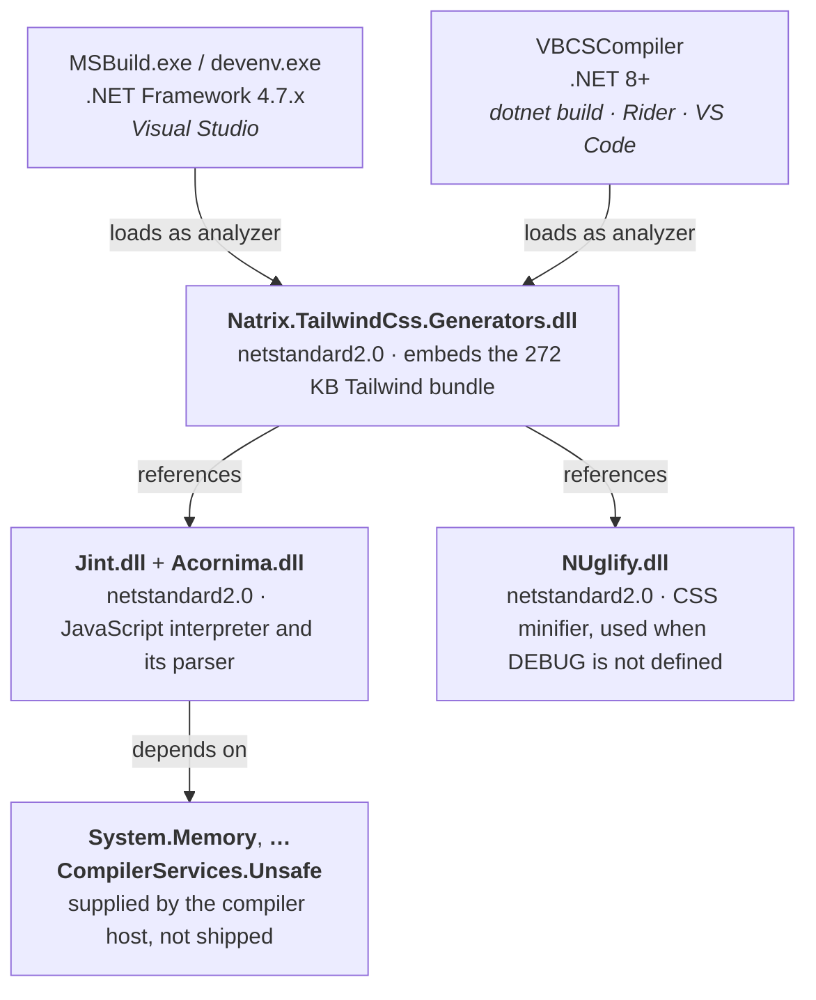
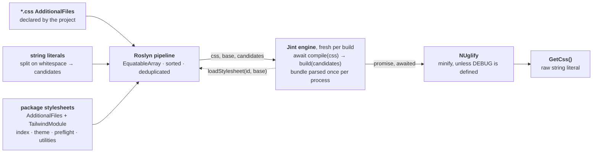

# Tailwind CSS generator — architecture

Visual companion to [`CLAUDE.md`](CLAUDE.md), which holds the rules and the
reasoning. This file is just the two pictures worth drawing.

`[GeneratedTailwindCss("Styles/app.css")]` turns a partial method into the
compiled Tailwind stylesheet for that entry file. The generator runs the real
Tailwind compiler — the actual JavaScript, bundled by esbuild and executed in
Jint, a JavaScript interpreter written in .NET — during the build.

## Runtime layering

A source generator runs inside the compiler host, and that host is not always
the same runtime. Roslyn therefore requires the analyzer to be `netstandard2.0`
(RS1041). Jint has a `netstandard2.0` build and is pure managed code, so the
whole engine is two ordinary analyzer dependencies sitting beside the analyzer:
the same files on every host, OS and architecture.


```mermaid
flowchart TD
    FX["MSBuild.exe / devenv.exe<br/>.NET Framework 4.7.x<br/><i>Visual Studio</i>"]
    MOD["VBCSCompiler<br/>.NET 8+<br/><i>dotnet build · Rider · VS Code</i>"]

    AN["<b>Natrix.TailwindCss.Generators.dll</b><br/>netstandard2.0 · embeds the 272 KB Tailwind bundle"]
    JI["<b>Jint.dll</b> + <b>Acornima.dll</b><br/>netstandard2.0 · JavaScript interpreter and its parser"]
    HOST["<b>System.Memory</b>, <b>…CompilerServices.Unsafe</b><br/>supplied by the compiler host, not shipped"]

    FX -->|loads as analyzer| AN
    MOD -->|loads as analyzer| AN
    AN -->|references| JI
    JI -->|depends on| HOST
    AN -->|references| NU["<b>NUglify.dll</b><br/>netstandard2.0 · CSS minifier, used when DEBUG is not defined"]
```

All four of our files ship in `analyzers/dotnet/cs/`. Each compilation runs on a
dedicated 16 MB thread under a JavaScript call-depth limit, because Jint
interprets on the CLR stack and an overflow would kill the compiler server.

This used to be a much bigger picture. Until October 2026 the engine was V8 via
ClearScript: a bridge assembly built for two host runtimes and loaded by
reflection, a contract assembly that had to load exactly once, and a native V8
library per RID — about a quarter of a gigabyte. CLAUDE.md's *History* records
why it went.

## How a stylesheet becomes a string


```mermaid
flowchart LR
    CSS["<b>*.css AdditionalFiles</b><br/>declared by the project"]
    LIT["<b>string literals</b><br/>split on whitespace → candidates"]
    EMB["<b>package stylesheets</b><br/>AdditionalFiles + TailwindModule<br/>index · theme · preflight · utilities"]

    PIPE["<b>Roslyn pipeline</b><br/>EquatableArray · sorted · deduplicated"]
    JS["<b>Jint engine</b>, fresh per build<br/>await compile(css) → build(candidates)<br/>bundle parsed once per process"]
    MIN["<b>NUglify</b><br/>minify, unless DEBUG is defined"]
    OUT["<b>GetCss()</b><br/>raw string literal"]

    CSS --> PIPE
    LIT --> PIPE
    EMB --> PIPE

    PIPE -->|"css, base, candidates"| JS
    JS -.->|"loadStylesheet(id, base)"| PIPE
    JS -->|"promise, awaited"| MIN
    MIN --> OUT
```

The dotted arrow is the load-bearing one. Tailwind calls back into C# for every
`@import`, and resolution never touches the filesystem — each one is answered
from the `AdditionalFiles` snapshot Roslyn supplied. That is precisely what makes
editing a `.css` file re-run the compilation.

Note the asymmetry it creates: the pipeline reads *every* stylesheet the project
listed, while the resolver serves only the ones actually imported. A file nothing
imports never reaches the output, but editing it still invalidates the step and
re-runs the compile.

### How an import is resolved

The package globs nothing on the project's behalf — a project lists its own
stylesheets as `AdditionalFiles`. An `@import` is then answered in this order:

1. **Relative to the importing file** — `./x`, `../x`, or a bare `x`. The
   directory it is relative to is the `base` Tailwind passes to `loadStylesheet`,
   which is the importing stylesheet's own directory. An already-absolute
   specifier is taken as it stands.
2. **Module ids.** Files carrying `TailwindModule` metadata register the ids they
   answer to. Matching is exact, like a `package.json` `"exports"` map: a file a
   package did not declare cannot be imported by id.

For 1 the resolver also tries `x.css` and `x/index.css`.

Relative wins over a module of the same name, matching `@tailwindcss/vite`: it
creates its CSS resolver with `preferRelative: true`, and Tailwind consults that
resolver before the `node_modules` lookup.

Every stylesheet is keyed by its absolute path, so nothing in resolution depends
on where a file sits relative to the project. The chain is anchored by the entry
stylesheet, whose path in `[GeneratedTailwindCss]` is resolved against the
**source file that declares the attribute**; its directory becomes the `base`
passed to `compile()`.

The `base` returned with each hit is the resolved file's **own directory**, which
is what lets a package reference its internal, unexported stylesheets while
callers cannot.

## What triggers a recompile

The generated CSS is produced by combining three pipeline values — the attributed
method, the stylesheet set, and the candidate set. Roslyn
compares each by value, so **the Tailwind compiler runs again whenever any one of
them differs**, and skips entirely when none do. In an IDE this is evaluated on
essentially every keystroke.

Every row below is pinned down by a test in `IncrementalityTests`.

### Re-runs the compiler

| Change | Why |
| --- | --- |
| Any `.css` file edited — **including one nothing imports** | The whole stylesheet set is a single pipeline value |
| A `.css` file added, removed or renamed | Same |
| A string literal that introduces a **new** whitespace-separated token | The candidate set changed |
| Editing anything **above the attribute in its own file** | The model carries the attribute's text span for diagnostics, and inserting a line shifts it |
| The attribute argument, method name, accessibility, `static`, or return type | All part of the method model |
| Moving the file the attribute is declared in | The entry stylesheet is resolved against that file's directory, so the same attribute text means a different stylesheet |
| Defining or undefining `DEBUG` | Switches minification; no other parse option counts |
| A Tailwind, Jint or NUglify version bump | Changes the analyzer or its dependencies |

### Skips the compiler

| Change | Why |
| --- | --- |
| C# edits that add no new candidate token — renaming a local, adding a method, a new file with no literals | Candidates are deduplicated |
| A new literal repeating a class name already present somewhere | Same |
| Rewriting a `.css` file with byte-identical content | `EquatableArray` compares by value, not by `AdditionalText` identity |
| Reordering `.css` files, or reordering string literals | Both sets are sorted before they enter the pipeline |

### How much it costs

Every trigger costs a full compile. Measured warm on the docs app (440
candidates, the full Tailwind index), that is about **90–100 ms**, nearly all of it
Tailwind's own `compile()` and `build()` running in the interpreter. A fresh
engine and re-running the bundle in it cost under a millisecond. The first compile
in a process takes about 1.2 s, mostly warming up Jint and parsing the bundle,
which is then shared by every later compilation. V8 was about 6× faster warm
(~13–17 ms) at the same cold cost; that trade is recorded in CLAUDE.md.

Caching Tailwind's compiled stylesheet across runs is deliberately *not* done.
Tailwind's `build()` is incremental — it returns the union of every candidate it
has ever seen — so a reused compilation keeps emitting classes deleted from the
source unless the candidate set is guarded for growth. That guard worked, but the
subtlety was not worth it.

In an IDE a superseded compile does not finish: Roslyn's cancellation token
reaches Jint, so a run started by one keystroke stops when the next one arrives.

The case to watch is the first row: because the stylesheet set is all-or-nothing,
a large vendored `.css` in the set makes every edit to it re-run Tailwind even
though it is never imported. The package globs nothing on the project's behalf,
so the fix is simply to list less:

```xml
<ItemGroup>
  <AdditionalFiles Include="Styles\**\*.css" />
</ItemGroup>
```

## Reference

| | |
| --- | --- |
| Projects | `Natrix.TailwindCss` (the package; its only code is the hot-reload runtime) · `Natrix.TailwindCss.Generators` (`netstandard2.0`) · `Natrix.TailwindCss.Tests` |
| Build hosts | Anything .NET runs on — nothing native, nothing per RID |
| Key packages | `Microsoft.CodeAnalysis.CSharp` · `Jint` · `Acornima` · `NUglify` · npm `tailwindcss`, `esbuild` |
| Package layout | `analyzers/dotnet/cs/` (analyzer, Jint, Acornima, NUglify) · `build/`+`buildTransitive/` (targets) · `tools/tailwindcss/` (Tailwind's stylesheets) |

Everything else — the constraints, the MSBuild traps, the diagnostics, and the
history of what was tried and replaced — is in [`CLAUDE.md`](CLAUDE.md).
